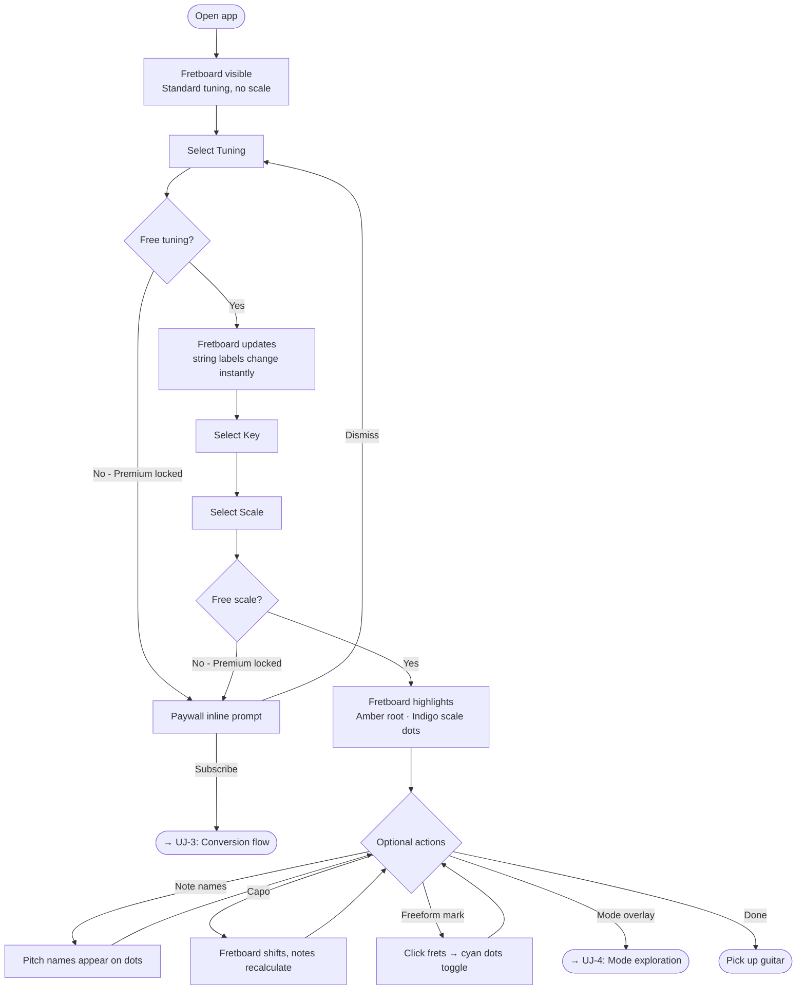
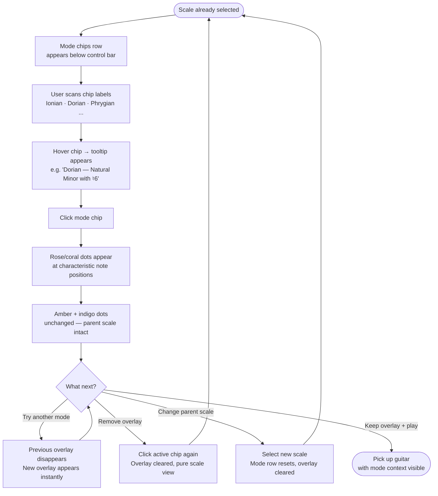
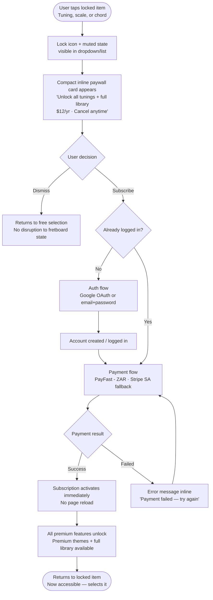
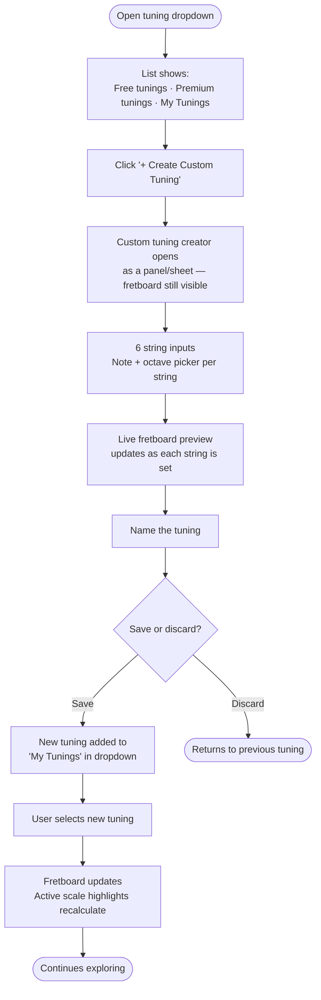

# UX Design Specification personal_projects

**Author:** Voice.mijalkovic
**Date:** 2026-05-23

---

<!-- UX design content will be appended sequentially through collaborative workflow steps -->

## Executive Summary

### Project Vision

Guitar App is a fretboard visualization tool built for the songwriter/explorer — someone mid-session who needs to instantly see how a scale, mode, or chord shape sits on the neck in any tuning. It takes Guitar Pro 6's core fretboard+scale highlight concept and rebuilds it as a focused, modern web tool: less feature sprawl, more visual clarity. The fretboard is the hero; everything else steps back.

Inspired by Guitar Pro 6's scale highlight function but with a fundamentally cleaner, more modern visual approach. The tool should feel like a pro instrument, not an educational website.

### Target Users

**Primary:** Voice — guitarist and songwriter who regularly works across multiple tunings. Desktop-first usage during writing/practice sessions, occasional phone reference. Wants speed and visual clarity over feature depth. A short, effective session is success.

**Secondary:** Guitarists who experiment with alternate tunings (drop, open, custom) and need a fast visual reference without navigating a DAW or tab editor.

**Usage context:** Desktop-primary (planning/writing sessions), mobile-secondary (quick reference). Users know music theory — no hand-holding needed.

### Key Design Challenges

1. **Fretboard density vs. clarity** — A 24-fret, 6-string grid with highlights, note names, fret markers, and capo indicators is inherently dense. The challenge is keeping it breathable and immediately readable, especially on a phone screen.

2. **Mode/scale selector as primary interaction** — The control surface (key → parent scale → mode) needs to feel fluid and musical, not like a form. Flipping through modes should feel like turning a dial, not filling dropdowns.

3. **Freemium gating without friction** — Paywall prompts appear in the tuning selector and library lists. They need to be visible but non-aggressive — the free experience should feel complete, not crippled.

4. **Desktop-primary but mobile-workable** — The fretboard needs to be the hero at 1280px wide and still usable at 375px without a completely different layout.

### Design Opportunities

1. **Mode exploration as a first-class UX** — No competitor treats mode-flipping as a primary interaction. Designing this as a "tonal center → parent scale → mode dial" flow could be the app's most distinctive feature and a key differentiator.

2. **Dark-mode visual identity** — The existing dark theme (`#080810`, indigo scale dots, amber root dots) is already strong. Leaning into high-contrast highlights that pop against near-black creates a visual experience closer to a pro tool than an education site.

3. **Songwriter's context, not student's context** — The copy, UI hierarchy, and default states should assume the user knows what A Major is. Skip theory explanations, surface the fretboard immediately.

## Core User Experience

### Defining Experience

The core loop is minimal and intentional: open the app → pick a tuning → pick a root + scale → the fretboard immediately shows highlights. That's it. No menus to navigate, no waiting, no "view fretboard" button. The fretboard is already there.

Mode exploration is a secondary layer on top of this loop — the user can optionally overlay a mode's characteristic notes on the active parent scale to see what's different without losing the parent context. The root note stays fixed; only the overlay changes.

### Platform Strategy

- **Web app, desktop-primary.** Instant load is a primary differentiator over Guitar Pro. No install, no splash, no wait.
- **Mouse/keyboard on desktop.** Tuning, key, and scale selectors should be reachable in 2–3 clicks maximum from any state.
- **Mobile-responsive, not mobile-first.** The fretboard must remain usable on a phone but the desktop experience is the one to optimise for.
- **No offline requirement.** Web-native, always-connected is fine for v1.

### Effortless Interactions

- **The fretboard is visible on load** — no navigation step, no "view fretboard" click. User lands on the fretboard.
- **Key + scale selection is always visible** — the selector controls are never hidden behind a menu. They're part of the primary view.
- **Scale highlights respond instantly** — any change to tuning, key, or scale reflects on the fretboard in under 100ms with no loading state.
- **Mode overlays are a single action** — flipping to a mode adds a visual layer without clearing the parent scale. Removing it is the same single action.
- **Fretboard fills the screen** — no fixed small size like Guitar Pro. The fretboard uses available space and scales with the window.

### Critical Success Moments

1. **First load** — the fretboard is visible immediately. No onboarding, no modals, no "get started" screens blocking it.
2. **Scale highlight** — user picks A Minor and every note of A Minor lights up across all 24 frets instantly. This is the core "aha" moment.
3. **Mode overlay** — user switches to Dorian and sees the ♮6 position distinctly marked on top of the minor scale they already know. They see exactly one note difference. That's the insight.
4. **Tuning switch** — user changes to Drop D and the entire highlight pattern shifts in real time. No page reload, no recalculation delay.

### Experience Principles

1. **Zero to fretboard** — the fretboard is the landing state. Nothing gates access to it.
2. **Scale with the screen** — the fretboard should be as large as the viewport allows. The user controls the size by resizing the window.
3. **Overlay, don't replace** — mode exploration adds information rather than resetting context. The parent scale is always the foundation.
4. **Instant and silent** — every interaction reflects immediately with no loading feedback. Sub-100ms changes should feel like they happen at the speed of thought.
5. **Controls defer to the fretboard** — selectors, toggles, and library panels are compact and secondary. The fretboard gets the space.

## Desired Emotional Response

### Primary Emotional Goals

**Creative readiness** is the defining feeling. Opening the app should feel like picking up a guitar — an immediate sense of "I'm about to explore something." The tool should prime curiosity and creative momentum, not demand attention for itself.

**Empowered clarity** follows from finding a scale or mode: the user sees exactly where those notes live on their neck, in their tuning, and can play directly from that knowledge. The app reveals; the guitarist executes.

### Emotional Journey Mapping

| Moment | Target Feeling |
|---|---|
| Opening the app | Anticipation — ready to explore, nothing in the way |
| Picking key + scale | Focused — quick, deliberate, no second-guessing |
| Seeing highlights on the fretboard | Clarity — "I can see it, I know where to put my fingers" |
| Flipping through modes | Curiosity — discovering what shifts, what stays, new lines emerging |
| Returning to the app next session | Familiarity — back in flow immediately, no re-learning |

### Micro-Emotions

- **Confidence over confusion** — every control is immediately understandable; tooltips fill any gap
- **Inspiration over information** — the fretboard sparks ideas, it doesn't lecture
- **Flow over friction** — nothing interrupts the exploratory state
- **Delight through simplicity** — the app works so cleanly it occasionally surprises you

### Emotions to Avoid

- **Frustration** — waiting, clicking through menus, tiny unreadable fretboard
- **Overwhelm** — too many controls visible at once, options that need explaining before they're useful
- **Intimidation** — feeling like you need to learn the tool before the tool helps you
- **Confusion** — any control whose purpose isn't self-evident within 2 seconds

### Design Implications

- **Tooltips on every non-obvious control** — short, plain-language, appear on hover. Not tutorials; just instant context.
- **Progressive disclosure** — the primary view shows only what's needed for the core loop. Advanced options (mode overlay, freeform marks, note name toggle) are accessible but don't crowd the default state.
- **No loading states on core interactions** — scale/tuning changes are silent and instant. Any perceived latency breaks flow.
- **Fretboard size = confidence** — a large, readable fretboard is an emotional UX decision, not just a visual one. Small = frustrating. Big = empowering.
- **Options are self-explanatory** — label choices with real musical terms (not "Mode 2" but "Dorian"). Users know what Dorian is; they don't need a definition, just the name.

### Emotional Design Principles

1. **Open to explore** — the app's entry state should feel like an invitation, not a form to fill out
2. **Reveal, don't teach** — surface musical relationships visually; trust the user to interpret them
3. **Tooltips as safety net** — every option is labelled well enough to use without a tooltip, but tooltips are there if needed
4. **Earn flow, then protect it** — get the user into a creative state fast, then do nothing to break it

## UX Pattern Analysis & Inspiration

### Inspiring Products Analysis

**Songsterr** — the primary UX reference. Its key strengths:
- The *content is always the hero* — the tab/fretboard view fills the screen and nothing competes with it
- Controls are persistent but minimal — navigation doesn't get in the way of playing
- Premium is visible but non-aggressive — "Songsterr Plus" is present in the header without blocking the free experience
- Clean, modern aesthetic — it reads like a SaaS tool, not a music education site
- Instant interaction — clicking a song gets you into the tab immediately, no friction

**Guitar Pro 6 (functional reference, anti-reference aesthetically)** — what to take:
- The scale highlight concept itself — notes lighting up in the active tuning is exactly right
- The fretboard-as-primary-view mental model

**What Guitar Pro taught us to avoid:**
- App load time before you can do anything
- Navigating to the fretboard view as a separate step
- Fixed small fretboard size that can't be resized
- UI chrome that competes with the fretboard for space

### Transferable UX Patterns

**From Songsterr:**
- **Content-dominant layout** — the fretboard fills the viewport the way Songsterr's tab view fills the screen. Controls live at the edges.
- **Persistent minimal controls** — tuning, key, scale selectors are always visible in a compact top bar, like Songsterr's instrument filter bar. Never hidden.
- **Premium as a natural upgrade layer** — locked themes and library items are visible with a clear but non-intrusive paywall marker. The free experience feels complete, not crippled.

**From pro audio tools (Ableton, etc.):**
- **Dark-first, high contrast** — dark background with bright highlighted elements. Optimised for dim-room use (playing in a studio or late night writing session).
- **Functional typography** — note names and fret numbers use a clean, legible mono or semi-mono typeface. No decorative fonts.

**Visual dot refinement (Voice's direction):**
- Dots slightly smaller and slightly transparent → elegant, less visual noise, notes don't feel stamped onto the fretboard
- Nut labels (note names, fret numbers) font slightly bigger → immediate readability, first thing you see when scanning the neck

### Anti-Patterns to Avoid

- **Realistic wood-texture fretboards** (Fret Monster) — feels dated, decorative over functional
- **Dense always-visible control panels** (Fretastic) — overwhelm before the user even starts
- **Loading states on scale/tuning changes** — breaks flow completely
- **Educational framing** (muted.io) — labels, explanations, and instructional copy inside the app; assumes the user doesn't know what they're doing
- **Separate "view fretboard" navigation step** (Guitar Pro) — the fretboard is the app, not a feature inside it

### Design Inspiration Strategy

**Adopt:**
- Songsterr's content-dominant layout principle — fretboard gets maximum screen real estate
- Songsterr's non-aggressive premium layer — themes, full library locked behind a clean paywall marker, never blocking the core experience
- Pro audio tool dark-first visual identity — already established with the current `#080810` base

**Adapt:**
- Songsterr's persistent minimal top bar → adapt for tuning/key/scale selectors specific to this app's core loop
- Songsterr Plus model → apply to themes (free: default dark; premium: neon, minimal, monochrome, vibrant) — themes become a visual delight unlock, not a core feature gate

**Build new:**
- Mode overlay interaction — no competitor has this; it's a first-class pattern unique to this app
- Theme system — treat visual themes as a premium collectible layer, not just a settings option

**Future (not v1):**
- Playback through scales/chords with speed/tempo control (noted; design the fretboard now in a way that doesn't block this later)

## Design System Foundation

### Design System Choice

**Tailwind CSS + shadcn/ui + CSS custom property theming.** Not a monolithic component library — a composable stack that gives a solo React developer full visual control with fast development.

### Rationale for Selection

- The fretboard is a bespoke canvas component — no design system provides it, so the system must not get in the way of custom rendering
- The existing React + Vite stack slots directly into Tailwind without configuration overhead
- Visual uniqueness is a competitive advantage; opinionated systems (MUI, Ant Design) impose aesthetic defaults that conflict with the dark, pro-tool identity
- shadcn/ui provides accessible headless components (dropdowns, modals, tooltips) without locking the project into a dependency — the developer owns the component code
- CSS custom properties enable the premium theme system with zero runtime cost — theme switching is a single attribute change on the document root

### Implementation Approach

- Tailwind as the primary styling layer for all layout, spacing, and typography
- shadcn/ui components for interactive UI primitives: tuning selector dropdown, library panel, paywall modal, tooltip system, capo slider
- Custom components for: fretboard canvas, dot rendering, mode overlay, note name labels, nut labels
- CSS custom properties define all design tokens: background, surface, string color, fret color, dot fill, dot opacity, root highlight, scale highlight, mode overlay highlight, text colors

### Customization Strategy

**Design tokens (CSS variables) per theme:**

| Token | Dark (free) | Neon (premium) | Mono (premium) | Vibrant (premium) | Minimal (premium) |
|---|---|---|---|---|---|
| `--bg` | `#080810` | `#0a0a0a` | `#1a1a1a` | `#0d1b2a` | `#f5f5f0` |
| `--dot-scale` | indigo | electric cyan | white | coral | slate |
| `--dot-root` | amber | electric green | light grey | gold | charcoal |
| `--dot-opacity` | 0.85 | 0.95 | 0.90 | 0.90 | 0.80 |
| `--dot-size` | slightly reduced from current | same | same | same | same |
| `--nut-font-size` | slightly increased from current | same | same | same | same |

Themes are locked by subscription status at the component level — attempting to apply a premium theme without a subscription falls back to dark silently.

## 2. Core User Experience

### 2.1 Defining Experience

> **"See your scale on your fretboard, in your tuning, instantly — then explore how the modes sit inside it."**

If Guitar Pro's fretboard view was the inspiration, this is the distillation: strip everything else away and make that one interaction — scale highlights in the active tuning — perfect. The mode overlay is the extension that makes it unique.

### 2.2 User Mental Model

Guitarists think **spatially and positionally**, not abstractly. The mental model is: *"I know what A Minor sounds like. I want to see where those notes are on my actual neck right now, in the tuning I'm playing in."*

Users bring these expectations to the tool:
- The fretboard orientation matches how they hold the guitar (low E left, high e right)
- A "scale" means all the notes of that scale across the whole neck, not just one position box
- Changing tuning should immediately shift every note position — the fretboard is a live mirror of the guitar
- Modes are variations of the parent scale, not separate entities — Dorian *is* A Natural Minor with a different characteristic note emphasis

**Existing mental model friction (from Guitar Pro):**
- "I have to navigate somewhere to see the fretboard" — doesn't match how guitarists think about it
- "The fretboard is small and fixed" — clashes with the spatial nature of the instrument
- "I can't see the whole neck at once" — forces mental interpolation

### 2.3 Success Criteria

| Interaction | Success Signal |
|---|---|
| App loads | Fretboard visible with no action required |
| Tuning change | String labels and all active highlights update in < 100ms |
| Scale selection | Every note of the scale lights up across all 24 frets simultaneously |
| Mode overlay | Characteristic notes appear as a distinct third colour, parent scale unchanged |
| Mode swap | Previous overlay disappears, new overlay appears instantly |
| Note Name Toggle | Pitch names appear/disappear at every dot without layout shift |
| Capo set | Fretboard shifts, note names update, highlights reposition — all at once |

**The user should never feel like they're waiting.** Any perceptible delay breaks the spatial/musical mental model.

### 2.4 Novel vs. Established Patterns

**Established (adopt directly):**
- Dropdown selectors for tuning, key, scale — users know how these work
- Toggle button for Note Name display
- Clickable fretboard for Freeform Marking
- Paywall lock icon on premium-gated items

**Novel (requires intentional design):**
- **Mode overlay system** — no competitor has this interaction; it needs to feel like a natural extension of scale selection, not a separate feature. Design approach: the modes panel appears contextually when a scale is selected, as a secondary row of chips/pills below the scale selector. Each chip is a mode name (Ionian, Dorian, Phrygian...). Tapping one overlays that mode's characteristic notes in a third distinct colour.
- **Overlay colour language** — three simultaneous visual states on the fretboard: root note (amber), parent scale notes (indigo), mode characteristic notes (a third accent — e.g. rose/coral). Must be immediately distinguishable without a legend.

**Familiar metaphors used:**
- Mode chips behave like filter tags — select one to add it, select again to remove
- The overlay is additive (like highlighting with a second marker colour), not a replacement

### 2.5 Experience Mechanics

**1. Initiation**
App loads → fretboard fills the screen in default state: Standard tuning, no scale selected, string/fret labels visible. Top control bar shows: `[Tuning ▾]` `[Key ▾]` `[Scale ▾]`. That's it. Nothing else demands attention.

**2. Core Interaction Flow**

```
User selects tuning → fretboard string labels update instantly
User selects key (e.g. A) → key indicator highlights, awaiting scale
User selects scale (e.g. Natural Minor) → fretboard highlights:
    • Amber dot = root note (A) across all octaves
    • Indigo dot = all other scale notes
    • Empty fret = not in scale (no dot)

[Optional] User opens mode panel → 7 mode chips appear:
    Ionian | Dorian | Phrygian | Lydian | Mixolydian | Aeolian | Locrian
User taps "Dorian" → characteristic note (♮6) appears as rose/coral dot
    → parent scale (indigo) and root (amber) remain unchanged
User taps another mode → previous overlay swaps to new one
User taps active mode chip → overlay removed, back to pure scale view
```

**3. Feedback**
- All fretboard changes are instant and silent — no spinners, no transitions on the dots themselves (or a very fast 80ms fade if it aids readability)
- Active selections shown inline in the control bar labels (e.g. `Drop D ▾` `A ▾` `Natural Minor ▾`)
- Active mode chip is visually highlighted (filled vs. outlined)
- Tooltips on hover for mode chips: e.g. *"Dorian — Natural Minor with a raised 6th (♮6)"*

**4. Completion**
There is no completion state — this is an open exploratory tool. The user looks at what they need and picks up the guitar. The app stays in whatever state they left it (authenticated users get persistence; unauthenticated state resets on page reload).

## Visual Design Foundation

### Color System

**Base palette — Dark theme (free default):**

| Token | Value | Usage |
|---|---|---|
| `--color-bg` | `#080810` | App background |
| `--color-surface` | `#0f0f1a` | Control bar, panels, dropdowns |
| `--color-surface-raised` | `#16162a` | Hover states, active dropdowns |
| `--color-border` | `#1e1e30` | Dividers, dropdown borders |
| `--color-fretboard` | `#0b0b16` | Fretboard surface (slightly distinct from bg) |
| `--color-string` | `#3a3a5c` | String lines |
| `--color-fret` | `#1a1a2e` | Fret bar lines |
| `--color-fret-marker` | `#1e1e35` | Position marker dots (3, 5, 7, 9, 12) |
| `--color-text-primary` | `#e2e8f0` | Primary labels, note names |
| `--color-text-secondary` | `#64748b` | Secondary labels, fret numbers |
| `--color-text-muted` | `#334155` | Disabled states, placeholders |

**Highlight palette — the three dot colours:**

| Token | Value | Name | Usage |
|---|---|---|---|
| `--color-dot-root` | `#f59e0b` | Amber | Root note — always fully opaque |
| `--color-dot-scale` | `#6366f1` | Indigo | All other scale notes |
| `--color-dot-mode` | `#fb7185` | Rose | Mode characteristic overlay notes |
| `--color-dot-freeform` | `#22d3ee` | Cyan | Freeform user-marked notes |

**Dot rendering rules:**
- Root dot: 100% opacity, full size — the anchor, always dominant
- Scale dots: 85% opacity, slightly reduced size from current
- Mode overlay dots: 90% opacity, same size as scale dots, subtle outer glow to read as "layered on top"
- Freeform dots: 80% opacity, dashed or ring style to distinguish from library highlights

**Premium theme token overrides:**

| Theme | `--color-dot-root` | `--color-dot-scale` | `--color-dot-mode` |
|---|---|---|---|
| Dark (free) | `#f59e0b` amber | `#6366f1` indigo | `#fb7185` rose |
| Neon (premium) | `#4ade80` green | `#22d3ee` cyan | `#f0abfc` pink |
| Mono (premium) | `#f1f5f9` white | `#94a3b8` slate | `#cbd5e1` light slate |
| Vibrant (premium) | `#fbbf24` gold | `#818cf8` violet | `#f87171` coral-red |
| Minimal (premium) | `#92400e` dark amber | `#3730a3` dark indigo | `#9f1239` dark rose |

### Typography System

**Fonts:**
- **JetBrains Mono** — all fretboard text: note names, nut string labels, fret numbers, scale degree indicators
- **Inter** — all UI chrome: control labels, dropdowns, tooltips, navigation, paywall prompts

**Type scale:**

| Element | Font | Size | Weight | Notes |
|---|---|---|---|---|
| Note name inside dot | JetBrains Mono | 10px | 500 | Fits within dot bounds |
| Nut string labels (E A D G B e) | JetBrains Mono | 14px | 600 | Slightly larger per direction |
| Fret position numbers | JetBrains Mono | 11px | 400 | Muted colour, below fretboard |
| Mode chip label | Inter | 12px | 500 | e.g. "Dorian" |
| Dropdown option | Inter | 14px | 400 | Tuning/key/scale selectors |
| Control bar label | Inter | 13px | 500 | Active selection display |
| Tooltip body | Inter | 12px | 400 | Plain language, max 1 line |
| Section header | Inter | 15px | 600 | Library panel headers |
| Paywall prompt | Inter | 13px | 400 | Non-aggressive, muted |

### Spacing & Layout Foundation

**Base unit:** 4px (Tailwind default)

**Key measurements:**

| Element | Value | Tailwind |
|---|---|---|
| Control bar height | 48px | `h-12` |
| Gap between control bar items | 8px | `gap-2` |
| Fretboard horizontal padding | 16px | `px-4` |
| Fretboard vertical padding | 12px | `py-3` |
| Dot diameter (scale) | 18px | custom |
| Dot diameter (root) | 20px | custom |
| Mode chips row height | 32px | `h-8` |
| Gap between mode chips | 6px | `gap-1.5` |
| Panel padding | 16px | `p-4` |
| Dropdown item height | 36px | `h-9` |

**Layout structure (desktop):**
```
┌─────────────────────────────────────────────┐
│  Control bar (48px) — Tuning | Key | Scale  │
│  Mode chips row (32px, conditional)          │
├─────────────────────────────────────────────┤
│                                             │
│         FRETBOARD (fills remaining height)  │
│                                             │
└─────────────────────────────────────────────┘
```

**Mobile (≤768px):** Control bar wraps to two lines; fretboard scrolls horizontally; dots scale down proportionally at minimum 375px viewport.

### Accessibility Considerations

- Amber (`#f59e0b`) on `#080810`: contrast ratio ~7.2:1 — passes WCAG AA
- Indigo (`#6366f1`) on `#080810`: contrast ratio ~4.6:1 — passes WCAG AA large text; note names inside dots may need weight boost at small sizes
- Rose (`#fb7185`) on `#080810`: contrast ratio ~5.1:1 — passes WCAG AA
- JetBrains Mono at 10px (note names inside dots): acceptable; Note Name Toggle is off by default so this is an opt-in density
- Tooltips: minimum 12px Inter, `--color-surface-raised` background, full opacity

## Design Direction Decision

### Design Directions Explored

Six layout directions were evaluated against the core principles of fretboard dominance, minimal chrome, and songwriter-focused clarity:

- **A** — Persistent top control bar (chosen)
- **B** — Left side panel
- **C** — Bottom transport bar (DAW style)
- **D** — Floating HUD overlay
- **E** — Split view with inline library
- **F** — Minimal top bar + library drawer

Full interactive mockups at: `ux-design-directions.html`

### Chosen Direction

**Direction A — Persistent Top Control Bar**, with a modular layout architecture that allows other directions to be activated without structural refactoring.

### Design Rationale

Direction A wins on every primary criterion: fretboard gets maximum height, all core controls are immediately visible without navigation, mode chips appear contextually, and it scales cleanly to mobile. It matches the Songsterr mental model that was the UX reference.

The modularity requirement means Direction A is the *default configuration*, not the only possible configuration. The React app is structured so that swapping to Direction B, C, or D is a config change, not a rebuild.

### Implementation Approach — Modular Layout Architecture

The React app separates **layout zones** from **zone content**. Each zone is a named slot; the layout shell determines where each slot renders.

**Zone definitions:**
```
ZONE: top-bar        → Tuning / Key / Scale selectors + icon buttons
ZONE: mode-row       → Mode chips (conditionally rendered when scale active)
ZONE: fretboard      → The fretboard canvas — always present
ZONE: library-panel  → Scale/chord library (panel, drawer, or sidebar)
ZONE: bottom-bar     → Optional transport/control bar
```

**Layout config object:**
```js
// Direction A (default)
const LAYOUT_TOP_BAR = {
  topBar: true,
  modeRow: true,       // conditional on scale selection
  sidePanel: false,
  bottomBar: false,
  libraryMode: 'drawer'  // 'drawer' | 'sidebar' | 'inline' | 'modal'
}
```

**React structure:**
```
<AppShell layout={activeLayout}>
  <TopBar slot="top-bar" />
  <ModeChipsRow slot="mode-row" />
  <Fretboard slot="fretboard" />
  <LibraryPanel slot="library-panel" />
  <BottomBar slot="bottom-bar" />
</AppShell>
```

`AppShell` reads the layout config and uses CSS Grid to position each named slot. Switching layout = changing the config object. Each zone component is self-contained and unaware of its position.

This architecture also enables layout variants tied to premium themes, and easy A/B testing without branching the codebase.

## User Journey Flows

### UJ-1: Core Exploration Loop (Primary daily use)

The most common flow — open, configure, explore.



**Optimisations:**
- Fretboard is visible at step B with zero user action — no loading gate
- Tuning, key, scale each update the fretboard independently and immediately
- Paywall prompt is inline (no modal blocking the fretboard) — user can dismiss and keep using the free set
- "Done" has no explicit action — the user just stops and plays

### UJ-4: Mode Exploration (Distinctive feature)

Builds on top of an active scale selection.



**Optimisations:**
- Mode row only appears after a scale is selected — zero clutter in default state
- Tooltips give musical context without requiring the user to know mode theory from memory
- Overlay is additive — user never loses the parent scale context
- Swapping modes is instant with no transition delay

### UJ-3: Free-to-Paid Conversion

Triggered when a free user taps a locked item.



**Optimisations:**
- Paywall card is compact and non-modal — fretboard stays fully visible behind it
- Free tier state preserved through auth and payment flow
- Subscription activates without reload — unlock feels instant
- Failed payment keeps user on payment screen with no back-tracking

### UJ-2: Custom Tuning Creation (Premium)



**Optimisations:**
- Live fretboard preview updates as each string is set — user sees the open-string notes in real time
- Creator opens as a sheet/panel, not a blocking modal — fretboard context stays visible
- Custom tunings appear under "My Tunings" in the same dropdown — no separate navigation

### Journey Patterns

**Paywall pattern — always inline, never blocking:**
Locked items are visible with a lock indicator. Tapping them shows a compact paywall card anchored to the element, not a full-screen modal. Fretboard state is never cleared by a paywall interaction.

**Immediate feedback pattern:**
Every selection (tuning, key, scale, mode, capo) reflects on the fretboard before any confirmation. No "Apply" button. The fretboard is always a live mirror of current selections.

**Additive state pattern:**
Mode overlay, note names, capo, and freeform marks are all additive layers. Activating one never clears another. The user builds up context and removes it deliberately.

**Return-to-context pattern:**
After any interruption (paywall, auth, custom tuning creator), the user is returned to exactly the state they left — active tuning, key, scale, and overlay preserved.

## Component Strategy

### Design System Components (shadcn/ui — use directly)

| Component | Usage |
|---|---|
| `Select` / `DropdownMenu` | Tuning, key, scale selectors |
| `Tooltip` | Mode chip descriptions, icon button labels |
| `Sheet` | Custom tuning creator, library drawer (mobile) |
| `Dialog` | Paywall prompt (desktop modal variant) |
| `Slider` | Capo position (frets 0–12) |
| `Button` | Subscribe CTA, icon buttons |
| `Badge` | Lock indicator on premium items |
| `Separator` | Dividers in control bar and library panel |

All styled via CSS custom property tokens — no component internals modified.

### Custom Components

#### `AppShell`
CSS Grid container with named zone areas (`top-bar`, `mode-row`, `fretboard`, `library-panel`, `bottom-bar`). Accepts a `layout` config prop. Each child declares its slot. Default is Direction A. Landmark roles on each zone (`<header>`, `<main>`, `<aside>`).

#### `FretboardCanvas`
SVG fretboard renderer. Props: `tuning`, `capo`, `highlights[]` (`{ string, fret, type }`). Renders strings, frets, position markers, nut, labels, fret numbers, and `FretDot` children. Full 24-fret desktop; scrollable on mobile. `role="img"` with descriptive `aria-label`.

#### `FretDot`
Single highlighted fret position. States: `root` (amber, 20px, 100%), `scale` (indigo, 18px, 85%), `mode` (rose, 18px, 90%, glow), `freeform` (cyan, 18px, 80%, dashed ring). Optional note name label controlled by Note Name Toggle. Each dot has `aria-label` with note name and position.

#### `ControlBar`
Persistent top bar. Anatomy: logo · divider · `TuningSelect` · `KeySelect` · `ScaleSelect` · spacer · icon buttons. `<header>` landmark, keyboard-navigable.

#### `ModeChipsRow`
Conditional row — renders only when a scale is active. Houses 7 `ModeChip` components. Hidden state (no scale) vs visible state (scale active, one chip optionally active in rose/coral).

#### `ModeChip`
Individual mode chip. States: default · hover · active. `Tooltip` with plain-language interval description (e.g. *"Dorian — Natural Minor with ♮6"*). `aria-pressed` reflects active state.

#### `LibraryPanel`
Scale/chord library. Variants: `mode="drawer"` (Direction A/F) · `mode="sidebar"` (Direction B/E) · `mode="sheet"` (mobile). Contains section headers, search/filter, `LibraryItem` list, locked section divider.

#### `LibraryItem`
Single scale or chord entry. States: default · active (indigo tint, checkmark) · locked (muted, `Badge` lock icon, tapping triggers `PaywallCard`) · preview (selectable, labelled). `role="option"`, `aria-selected`, `aria-disabled`.

#### `PaywallCard`
Compact inline upgrade prompt anchored to the triggering element via Floating UI. Max width 280px, never covers fretboard. Anatomy: headline · 3-bullet feature list · price ($12/yr) · subscribe CTA · dismiss. CTA triggers auth if unauthenticated, payment if authenticated.

#### `CustomTuningCreator`
Opens as shadcn/ui `Sheet`. Six string rows (note + octave selectors each) · tuning name input · Save/Discard · live read-only `FretboardCanvas` preview updating as strings are set. Each row labelled "String N".

### Component Implementation Roadmap

**Phase 1 — Core loop:**
`AppShell` · `FretboardCanvas` · `FretDot` · `ControlBar` · `ModeChipsRow` · `ModeChip`

**Phase 2 — Library + freemium:**
`LibraryPanel` · `LibraryItem` · `PaywallCard` · capo `Slider`

**Phase 3 — Premium features:**
`CustomTuningCreator` · `ThemeSelector` · chord progression components

## UX Consistency Patterns

### Button Hierarchy

| Level | Style | Usage |
|---|---|---|
| **Primary** | Filled, indigo bg, white text | Subscribe CTA, Save (custom tuning) |
| **Secondary** | Outlined, `--border`, `--text-primary` | Dismiss paywall, secondary actions |
| **Ghost** | No border/bg, `--text-secondary`, hover bg | Cancel, Discard |
| **Icon** | 32px square, `--surface-raised`, `--border` | Note names, freeform, library, capo |
| **Chip** | Pill, outlined default, filled when active | Mode chips, filter tags |
| **Destructive** | Rose text, outlined rose border | Clear all freeform marks |

Rules: one primary action per view maximum · icon buttons always have a Tooltip · destructive actions require `AlertDialog` confirmation · disabled state uses `--text-muted` at 40% opacity.

### Feedback Patterns

**Immediate (silent):** All fretboard changes (tuning, key, scale, capo, mode) reflect in < 100ms with no toast or spinner. The fretboard *is* the feedback.

**Transient success toast:** Only for non-visual actions. Custom tuning saved → `"Drop Cmin saved"` 3s toast. Subscription activated → `"Premium unlocked"` 4s toast. Style: `--surface-raised` bg, bottom-right, no colour coding.

**Inline error:** Payment failed → within payment form. Empty tuning name → below name field. Rose/coral 12px Inter text.

**Confirmation (destructive only):** Clear freeform marks → `AlertDialog`: *"Clear all marks? This can't be undone."* Delete custom tuning → same pattern.

### Selector Patterns

**Label format:** `[Category muted] [Active Value primary] ▾`

**Dropdown structure:** Free items first (section header) · Premium items with lock badge · My Tunings section (premium) · Create Custom Tuning at bottom.

**Behaviour:** Selection is immediate — no Apply button. Locked items visible but non-selectable; clicking triggers `PaywallCard`. Keyboard: arrows navigate, Enter selects, Escape closes.

### Tooltip Patterns

Show on hover (300ms delay desktop) / long-press (500ms mobile). One sentence max. Mode chips: *"[Mode] — [parent scale] with [interval difference]"*. Icon buttons: action label only. Style: `--surface-raised` bg, 12px Inter, max-width 200px.

### Empty and Loading States

**No scale selected:** Fretboard renders with strings/frets, no dots. No placeholder copy — this is the valid starting state.

**Library no results:** *"No scales match '[query]'"* in `--text-muted`. No illustration.

**Auth loading:** Selectors show skeleton state. Fretboard remains functional with default state — never blocked by auth check.

### Paywall Gate Patterns

Lock indicator: `Badge` with lock icon on all locked items — always visible. `PaywallCard` triggers on click. Card copy: feature-specific headline · max 3 benefit bullets · `$12/yr` always visible · CTA is always *"Subscribe"*. Post-subscription: all items unlock in-place, no reload.

### Navigation Patterns

Single-page app. State changes update URL query params for shareability (`?tuning=drop-d&key=A&scale=natural-minor`). Auth opens as `Sheet` overlay — never a full-page redirect. Settings (themes, account, tunings) open as `Sheet` from account icon in control bar.

### Mobile-Specific Patterns

- Selectors: native OS picker on iOS/Android
- Mode chips row: horizontally scrollable, no wrapping
- `LibraryPanel`: always bottom `Sheet`, never sidebar
- `PaywallCard`: bottom `Sheet` on mobile
- Freeform marking: requires explicit mode toggle to prevent accidental marks while scrolling

## Responsive Design & Accessibility

### Responsive Strategy

Desktop-first — primary target is 1024px+ (laptop/desktop). Mobile is a valid secondary use case for quick reference.

| Breakpoint | Target | Strategy |
|---|---|---|
| `≥ 1024px` | Desktop | Full Direction A. Fretboard fills remaining height. All 24 frets visible. |
| `768–1023px` | Tablet landscape | Same as desktop. Selector labels hidden, icon+value only. |
| `< 768px` | Tablet portrait / phone | Control bar stacks to two rows. Fretboard scrolls horizontally. Library/paywall → bottom Sheet. |
| `375px` | Minimum supported | Fretboard horizontal scroll, ~10 frets visible. Dots scale to 14px. |

### Breakpoint Strategy

Tailwind defaults (desktop-first):
- `xs < 480px` — small phones, graceful degradation
- `sm 480–767px` — phones
- `md 768–1023px` — tablets
- `lg 1024px+` — primary design target
- `xl 1280px+` — wide desktop, more fret space

**Control bar at `sm`:** Row 1: Logo + selectors. Row 2: mode chips (scrollable). Icon buttons collapse to `⋯` overflow menu.

### Accessibility Strategy

**Target: WCAG 2.1 AA.**

**Colour contrast (verified):** Amber 7.2:1 ✓ · Indigo 4.6:1 ✓ (large text) · Rose 5.1:1 ✓. All premium themes verified before shipping.

**Touch targets:** Minimum 44×44px effective touch area for all controls. Fret positions in freeform mode enlarged via tap zone padding.

**Keyboard navigation:** Tab order: Logo → Tuning → Key → Scale → Icon buttons → Mode chips. Mode chips: arrow keys to navigate, Enter/Space to toggle. Fretboard (freeform): arrows navigate positions, Space toggles mark.

**Focus indicators:** 2px indigo outline, 2px offset on all interactive elements. Never `outline: none` without a replacement.

**Screen reader:** `FretboardCanvas` has `role="img"` with dynamic `aria-label` updated on every state change: e.g. *"Guitar fretboard, Drop D tuning, A Natural Minor scale highlighted, Dorian mode overlay active"*. Fretboard visual content is not individually screen-reader-navigable — the aria-label summary is the accessible equivalent.

**Colour blindness:** Amber/indigo/rose trio passes deuteranopia and protanopia simulation. Note names provide non-colour distinction when enabled. Mono theme is designed for maximum contrast without colour reliance.

### Testing Strategy

- **Responsive:** Chrome DevTools + real devices: iPhone SE (375px), iPhone 14 (390px), iPad (768px), MacBook 13" (1280px). Browsers: Chrome, Firefox, Safari (critical for iOS WebKit), Edge.
- **Accessibility:** axe DevTools automated scan · keyboard-only full session · VoiceOver (macOS/iOS) primary screen reader test · NVDA (Windows) secondary.
- **Colour blindness:** Chrome DevTools Rendering → Emulate Vision Deficiencies, all 4 types per theme.

### Implementation Guidelines

- Typography in `rem` (10px = 0.625rem, 14px = 0.875rem)
- Fretboard height: `calc(100vh - var(--control-bar-height) - var(--mode-row-height))`
- Fretboard mobile scroll: `overflow-x: auto` on wrapper, `touch-action: pan-x` on SVG
- No `px`-fixed widths on fretboard — must reflow
- Semantic HTML: `<header>`, `<main>`, `<nav>`, `<button>` — never `<div onClick>`
- Skip link: `<a href="#fretboard" className="sr-only focus:not-sr-only">Skip to fretboard</a>` at top of `AppShell`
- Respect `prefers-reduced-motion`: dot transitions skip the 80ms fade when reduced motion is preferred
- shadcn/ui + Radix handle ARIA automatically — don't override unless necessary
